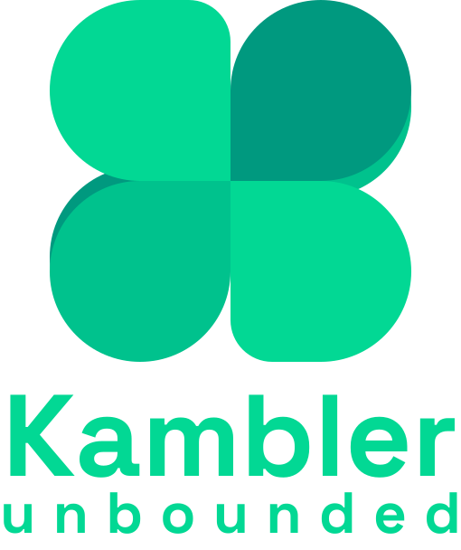

Github action workflow project [PROJECT REVOLUX]

### Versões

.svg)&nbsp;&nbsp;&nbsp;&nbsp;&nbsp;
.svg)&nbsp;&nbsp;&nbsp;&nbsp;&nbsp;
.svg)&nbsp;&nbsp;&nbsp;&nbsp;&nbsp;  
.svg)&nbsp;&nbsp;&nbsp;&nbsp;&nbsp;
.svg)

### Modelos de Template
https://docs.github.com/pt/actions/tutorials/create-actions/create-a-javascript-action 
https://docs.github.com/pt/actions/tutorials/create-actions/create-a-composite-action
